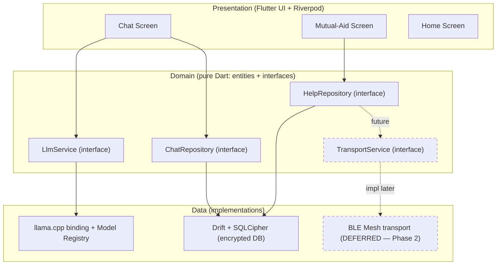
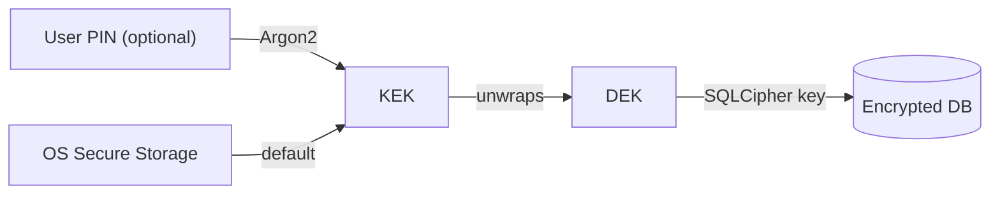
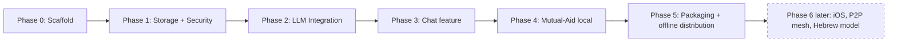

# LEV — Technical Specification (Software Design Document)

**Version:** 0.1 (Draft) · **Date:** 2026-07-30 · **Status:** Approved decisions, ready for implementation

> This document describes **how to build** LEV. It complements the **Product Specification** (what to build and for whom), which lives in the LEV project. Where the two disagree, the Product Specification defines *intent* and this document defines *implementation*.

---

## How to read this document

This document has **two audiences at once**:

- **Human developers** — read the prose and rationale; every technical choice explains *why* it was made and what alternatives were rejected.
- **AI coding agents** — the specifications, interfaces, data models, and the phased build plan (Section 9) are written to be unambiguous and directly actionable. When implementing, follow Section 9 in order; each phase lists concrete tasks and done-criteria.

**Guiding principle for the whole project:** *every technical decision is stated with a rationale, and diagrams are preferred over long text.*

---

## 1. Introduction & Context

### 1.1 Purpose
LEV is an independent, **offline-first**, privacy-preserving application offering two capabilities: a **supportive chat** powered by a **local language model**, and **local mutual-aid** (posting and fulfilling nearby help requests). This document defines the technical approach to building it: the technology stack, architecture, component design, data model, security model, and an ordered development plan.

### 1.2 Relationship to the Product Specification
The Product Specification defines the vision, target audience, user actions, screens, and non-functional constraints (full offline, technological independence, local P2P communication, on-device encryption, no identity tracking). This document takes those as **fixed requirements** and specifies how to satisfy them.

### 1.3 Glossary
- **LLM** — Large Language Model; the conversational model that powers the chat.
- **On-device / local LLM** — the model runs entirely on the user's device, with no server.
- **llama.cpp** — a C/C++ inference engine for running quantized LLMs on CPUs/GPUs across platforms.
- **GGUF** — the quantized model file format used by llama.cpp.
- **Quantization** — compressing model weights (e.g., to 4-bit) so the model fits and runs on consumer devices.
- **P2P (peer-to-peer)** — direct device-to-device communication, without a central server.
- **Mesh** — a network where devices relay messages for each other across multiple hops.
- **BLE** — Bluetooth Low Energy; a short-range radio present on virtually all phones and most laptops.
- **Drift** — a reactive, type-safe persistence library for Flutter built on SQLite.
- **SQLCipher** — an extension that transparently encrypts an entire SQLite database file.
- **DEK / KEK** — Data Encryption Key / Key Encryption Key; the two-tier "key wrapping" scheme (Section 7).
- **Riverpod** — the chosen Flutter state-management and dependency-injection framework.
- **Clean Architecture** — a layered design separating presentation, domain (business logic), and data.
- **NFR** — Non-Functional Requirement (performance, security, etc.).

---

## 2. Goals & Non-Goals

### 2.1 Goals (v1)
- Fully **offline**, including installation (distributed as installable files, not via app stores).
- **Cross-platform** from a single codebase: **Android, Windows, macOS, Linux** now; **iOS-ready** (compatible, released later).
- A **local-LLM supportive chat** that streams responses on-device.
- A **local mutual-aid** feature (create/edit/delete help requests; view/commit/cancel/complete help tasks).
- **Privacy by design**: on-device encryption at rest, no identity collection, no telemetry, no accounts/login.
- An architecture that keeps the **networking (P2P) layer pluggable** so it can be added later without disturbing the chat.

### 2.2 Non-Goals (explicitly out of scope for v1)
- **iOS release** — deferred (see Section 10). The codebase stays iOS-compatible, but iOS is not built/shipped in v1.
- **P2P transport implementation** — deferred to Phase 6 of the roadmap. The *abstraction* is built now; the BLE-mesh implementation is not.
- **Hebrew LLM** — no sufficiently good small Hebrew model exists yet; v1 ships an English model behind a multi-model abstraction so Hebrew can be added later.
- **Any server, cloud, or external auth** — prohibited by the product's independence requirement.
- **Cross-device sync** — the data model is designed to *allow* future sync, but sync itself is not implemented in v1.

---

## 3. Architecture Overview

### 3.1 The central insight: two independent feature domains
LEV is effectively **two near-independent products** plus shared infrastructure:

- **Chat** — entirely local; touches no network.
- **Mutual-Aid** — the feature that will eventually use P2P.

The Chat has **zero dependency** on networking. This is the most important architectural constraint: it lets us build and ship the Chat first, and add the (hard, risky) P2P layer later without reworking existing code.

### 3.2 Layered design (Clean Architecture)
Each feature is split into three layers:

- **Presentation** — Flutter widgets/screens + Riverpod providers. Knows nothing about *how* data is stored or fetched.
- **Domain** — business logic, entities, and **abstract interfaces** (e.g., `LlmService`, `TransportService`, repositories). Pure Dart, no framework or platform code.
- **Data** — concrete implementations of the domain interfaces: Drift database, llama.cpp binding, (future) BLE transport.

Dependencies point **inward**: Presentation → Domain ← Data. The domain never depends on the outer layers; the outer layers depend on the domain's interfaces. This is what makes the LLM engine, the storage, and the transport all swappable.

### 3.3 High-level architecture diagram



### 3.4 Folder structure (feature-first)
```
lib/
  core/                     # shared utilities, theming, constants, errors
    crypto/                 # DEK/KEK key management, Argon2 helpers
    di/                     # Riverpod global providers
    db/                     # Drift database + SQLCipher setup, DAOs
  features/
    chat/
      presentation/         # ChatScreen, widgets, ChatNotifier (Riverpod)
      domain/               # Message/Conversation entities, ChatRepository & LlmService interfaces
      data/                 # ChatRepository impl (Drift), LlmService impl (llama.cpp)
    mutual_aid/
      presentation/
      domain/               # HelpRequest/HelpTask entities, HelpRepository & TransportService interfaces
      data/                 # HelpRepository impl (Drift); TransportService stub (Phase 2)
    home/
      presentation/
  llm/                      # model registry, model selection, llama.cpp FFI wrapper
  app.dart                  # app root, routing
  main.dart
assets/
  models/                   # bundled GGUF model file(s)
```

**Rule for implementers:** a feature never imports another feature's `presentation` or `data`. Cross-feature interaction goes through `domain` interfaces wired in `core/di`.

---

## 4. Technology Stack (with rationale)

| Area | Choice | Why | Alternatives considered / rejected |
|---|---|---|---|
| Framework | **Flutter (Dart)** | Only framework covering mobile **and** desktop from one codebase; strong offline story | React Native (weaker desktop), native per-platform (3× the work) |
| State management | **Riverpod 3.x** | Low boilerplate, compile-safe, excellent dependency injection for our many abstractions | Bloc/Cubit (more structure, more boilerplate); GetX (anti-pattern) |
| Architecture | **Clean Architecture + feature-first** | Clean boundaries; keeps Chat independent of networking; predictable for humans and AI | Monolithic/ad-hoc (does not scale, hard to add P2P later) |
| LLM engine | **llama.cpp** | Cross-platform (mobile + desktop), runs quantized GGUF models, de-facto standard | ONNX Runtime, MLC-LLM (less universal for this use), platform-specific engines (not cross-platform) |
| LLM binding | **llama.cpp Dart/FFI binding** (e.g. `fllama` / `llama_cpp_dart`) | Bridges Flutter to llama.cpp; evaluate current maintenance at Phase 2 start | Writing a custom FFI layer (only if bindings prove inadequate) |
| Model (v1) | **Qwen** (small, quantized GGUF) | Reasonable quality at small size; runs on phones and desktops | English-only for v1; Hebrew models revisited later |
| Model management | **Multi-model abstraction** | Selects a model by device capability (RAM) and language; enables future Hebrew/desktop models | Hardcoding one model (blocks future growth) |
| Local database | **Drift (SQLite)** | Relational (ideal for help-request filtering), all platforms, actively maintained, reactive streams | Isar/Hive (unmaintained), Realm (discontinued), ObjectBox (server-based commercial sync — not our model) |
| Encryption at rest | **SQLCipher** (`sqlcipher_flutter_libs`) | Transparent full-database encryption, integrates with Drift, all platforms | App-level field encryption (more error-prone) |
| Key storage | **flutter_secure_storage** + **Argon2** | OS secure storage for the KEK; Argon2 to derive a key from an optional PIN | Storing keys in plaintext/prefs (insecure) |
| P2P transport | **Abstraction now; BLE-mesh later** | Requirement (strangers, no shared network) forces BLE mesh; deferred to reduce v1 risk | Local-network sockets (rejected: cannot serve strangers with no shared network) |
| Testing | **flutter_test + mocktail** | Unit-test domain logic against mocked interfaces; the clean boundaries make this easy | — |

---

## 5. Detailed Design (per component)

### 5.1 Chat feature
**Flow:** user types → `ChatNotifier.send(text)` appends the user message and sets `isTyping = true` → calls `LlmService.stream(prompt)` → streams tokens into the last assistant message → sets `isTyping = false` → persists the conversation via `ChatRepository`.

**Domain interface (illustrative):**
```dart
abstract class LlmService {
  /// Streams the model's reply token-by-token for a given prompt/history.
  Stream<String> stream(List<Message> history);
  /// Loads/switches the active model (see Model Registry).
  Future<void> loadModel(ModelDescriptor model);
}

abstract class ChatRepository {
  Stream<List<Message>> watchConversation(String conversationId);
  Future<void> append(Message message);
}
```

**Presentation (Riverpod):** a `NotifierProvider<ChatNotifier, ChatState>` holds `{ messages, isTyping }`. The UI `ref.watch`es it; sending calls the notifier. Streaming updates append/replace the trailing assistant message so the reply appears progressively.

### 5.2 LLM abstraction & Model Registry
A **Model Registry** holds a list of `ModelDescriptor`s (file path, language, min RAM, quantization). A **selection strategy** picks the best model for the current device and requested language:

```dart
class ModelDescriptor {
  final String id;            // e.g. "qwen-en-q4"
  final String assetPath;     // bundled GGUF file
  final String language;      // "en" (v1); "he" later
  final int minRamMb;         // gate on device capability
}

abstract class ModelSelector {
  ModelDescriptor selectFor({required String language, required int deviceRamMb});
}
```
v1 ships a single English Qwen descriptor. Adding a Hebrew or a larger desktop model later is a data change plus a new GGUF asset — no changes to Chat code.

### 5.3 Mutual-Aid feature
Entities: **HelpRequest** (posted by a user) and **HelpTask/Commitment** (a request another user has taken on). States a request/commitment moves through: `open → committed → completed` (plus `cancelled`). The screen supports the filters from the Product Spec (my requests / requests I committed to / by status).

In v1 the feature is **local-only** (data persists to the encrypted DB), but it is written against a `TransportService` interface so the P2P layer drops in later:

```dart
abstract class TransportService {
  Stream<HelpRequest> incomingRequests();       // from nearby peers (Phase 2)
  Future<void> broadcast(HelpRequest request);   // to nearby peers (Phase 2)
}
```
For v1, a **no-op/stub** implementation of `TransportService` is registered. The Mutual-Aid feature works fully on a single device; enabling real sharing later is swapping the stub for the BLE-mesh implementation.

### 5.4 Transport abstraction (deferred implementation)
The interface above is the only thing built in v1. See Section 10 for the deferred BLE-mesh decision and its constraints (mobile-centric; a local cryptographic device identity will be introduced with it).

### 5.5 Storage layer
Drift defines typed tables and DAOs. The database is opened through SQLCipher with the DEK provided by the key-management module (Section 7). All persistence — chat messages and help requests — goes through repositories so the rest of the app never touches SQL directly.

### 5.6 Security / key management
See Section 7 — the hybrid DEK/KEK wrapping scheme.

---

## 6. Data Model

**Design rule (sync-friendly):** every shareable entity uses a **UUID** primary key (never an auto-increment integer), carries `createdAt`/`updatedAt` timestamps and an `originDeviceId`, and treats deletes as **tombstones** (`isDeleted` flag) rather than hard deletes. This is what allows conflict-free merging when P2P sync is added later, without a v1 rewrite.

### 6.1 Entities
| Entity | Key fields |
|---|---|
| **Conversation** | `id (UUID)`, `title`, `createdAt`, `updatedAt` |
| **Message** | `id (UUID)`, `conversationId (UUID)`, `text`, `fromUser (bool)`, `createdAt` |
| **HelpRequest** | `id (UUID)`, `title`, `description`, `status (open/committed/completed/cancelled)`, `originDeviceId`, `createdAt`, `updatedAt`, `isDeleted` |
| **HelpCommitment** | `id (UUID)`, `requestId (UUID)`, `committerDeviceId`, `status`, `createdAt`, `updatedAt` |
| **ModelDescriptor** | (config, not user data) `id`, `assetPath`, `language`, `minRamMb` |
| **DeviceIdentity** | (Phase 2) locally generated cryptographic identity/keypair; never a login |

### 6.2 Example Drift table (illustrative)
```dart
class HelpRequests extends Table {
  TextColumn get id => text()();                       // UUID
  TextColumn get title => text()();
  TextColumn get description => text().withDefault(const Constant(''))();
  TextColumn get status => text().withDefault(const Constant('open'))();
  TextColumn get originDeviceId => text()();
  DateTimeColumn get createdAt => dateTime()();
  DateTimeColumn get updatedAt => dateTime()();
  BoolColumn get isDeleted => boolean().withDefault(const Constant(false))();
  @override
  Set<Column> get primaryKey => {id};
}
```

---

## 7. Security & Privacy

### 7.1 Threat model (v1)
Because v1 has **no network** for the chat and no server anywhere, the primary threat is **local**: someone gaining physical access to the device. There is no remote attacker surface for the chat in v1. (When P2P arrives, a nearby-radio attacker surface is added and must be re-assessed — see Section 10.)

### 7.2 Encryption at rest
The entire database is encrypted with **SQLCipher**. Plaintext user data is never written to disk outside the encrypted database.

### 7.3 Key management — hybrid (DEK/KEK "key wrapping")
- A random **DEK** (Data Encryption Key) actually encrypts the database (it is the SQLCipher key).
- The DEK is itself encrypted ("wrapped") by a **KEK** (Key Encryption Key).
- **Default mode (no PIN):** the KEK is stored in the OS secure store (`flutter_secure_storage`: Android Keystore / iOS Keychain / desktop secure storage). The app opens smoothly, no prompt.
- **Optional PIN/passphrase mode:** the KEK is **derived from the user's PIN** via **Argon2** and is not stored. Maximum privacy; if the PIN is forgotten, data is unrecoverable (there is no server).
- Enabling/disabling the PIN only **re-wraps the DEK** — the database is never re-encrypted.
- Biometric unlock (where available) can gate access to the secure-store KEK.



### 7.4 Privacy guarantees
No accounts, no login, no identity collection, no telemetry, no network calls in v1. "No login" does **not** mean "no identifier": the future P2P layer will generate a **local cryptographic identity** on-device (like Signal/Briar), never a server login.

### 7.5 Model file integrity
Bundled GGUF model files should be integrity-checked (e.g., hash verification) at load time to detect corruption/tampering.

---

## 8. Non-Functional Requirements

- **Performance (LLM):** define a **minimum device spec** (RAM/CPU). The Model Registry must refuse or downgrade gracefully on devices below spec. Target a first-token latency and a tokens/second floor per tier; larger quantizations may be used on desktop.
- **Battery & memory:** the model is loaded lazily and unloaded when idle; monitor memory footprint of the loaded model.
- **Offline:** no code path may require the network in v1. A network call is a defect.
- **Storage footprint:** the bundled model dominates install size; document the total and consider offering model tiers.
- **Cross-platform parity:** Android + Windows + macOS + Linux must reach feature parity; keep all platform-specific code behind interfaces so iOS can be added later.
- **Internationalization:** the **UI** must support English and Hebrew (including RTL) even while the **model** is English-only in v1.
- **Accessibility:** standard Flutter accessibility (semantics, contrast, scalable text).

---

## 9. Milestones & Build Steps

Build **in this order** — each phase depends on the previous. Every phase lists its goal, tasks, and done-criteria.



### Phase 0 — Project scaffold
- **Goal:** an empty, well-structured Flutter app that runs on Android + desktop.
- **Tasks:** create the Flutter project; set up the feature-first folder structure (Section 3.4); add Riverpod and wire a root `ProviderScope`; establish theming and routing; add `flutter_test` + `mocktail`.
- **Done when:** the app launches on Android and at least one desktop platform with an empty Home screen.

### Phase 1 — Storage & security foundation
- **Goal:** an encrypted local database that opens on all target platforms.
- **Tasks:** add Drift + `sqlcipher_flutter_libs`; implement the **DEK/KEK key-management** module (default secure-storage mode first, PIN mode second); define the schema (Section 6); expose repositories.
- **Done when:** data can be written and read back from the encrypted DB on Android + desktop; the DB file is unreadable without the key.

### Phase 2 — LLM integration
- **Goal:** run a local model and stream tokens.
- **Tasks:** evaluate and add a llama.cpp Dart/FFI binding; bundle the Qwen GGUF asset; implement `LlmService` (streaming) and the **Model Registry + selector**; add model-integrity check; enforce min-spec gating.
- **Done when:** a hardcoded prompt streams a coherent reply on Android + desktop within the target latency.

### Phase 3 — Chat feature (end-to-end)
- **Goal:** the full supportive chat.
- **Tasks:** build `ChatScreen` and widgets; `ChatNotifier` (Riverpod) with streaming; persist conversations via `ChatRepository`; wire Home → Chat navigation.
- **Done when:** a user can hold a multi-turn conversation that streams, persists across restarts, and survives navigating away and back.

### Phase 4 — Mutual-Aid feature (local-only)
- **Goal:** create/manage help requests and commitments on a single device.
- **Tasks:** build the Tasks screen with filters; implement `HelpRepository` (Drift) with the sync-friendly data model; implement the **no-op `TransportService` stub**; wire all Product-Spec actions (add/edit/delete request; commit/cancel/complete task).
- **Done when:** every Product-Spec mutual-aid action works locally and persists; nothing depends on a real transport.

### Phase 5 — Packaging & offline distribution
- **Goal:** installable, internet-free artifacts.
- **Tasks:** produce Android **APK** (sideload), Windows installer/portable, macOS `.app`/`.dmg` (document Gatekeeper override), Linux **AppImage**; verify install with no network; document install steps per platform.
- **Done when:** each artifact installs and runs on a clean, offline machine.

### Phase 6 — Deferred (later releases)
In dependency order when picked up: **(a)** iOS support (revisit native bindings for LLM + transport); **(b)** **P2P BLE-mesh transport** replacing the stub, with a local cryptographic device identity and a re-assessed threat model; **(c)** **Hebrew model** added to the Model Registry.

---

## 10. Risks & Open Decisions

- **P2P transport (deferred, highest risk).** Requirement: help requests must reach **total strangers with no shared network** → forces a **BLE-mesh** approach (Briar/Bridgefy model), which is **mobile-centric** (the Mutual-Aid sharing may be mobile-only even though Chat is all-platform). Deferred to Phase 6; the `TransportService` abstraction and sync-friendly data model keep the door open. **Status: open — implementation not started by design.**
- **Hebrew model gap.** The target audience includes Hebrew speakers and the chat's value is emotional nuance; an English-only model underserves them. Mitigation: multi-model abstraction now; add a Hebrew model when a good enough small one exists (evaluate DictaLM / larger multilingual on desktop).
- **On-device LLM performance on low-end devices.** Mitigation: min-spec gating and model tiers via the Model Registry.
- **iOS distribution.** Apple forbids sideloading arbitrary files; iOS release is deferred. Keeping code iOS-compatible depends on native binding availability for the LLM and transport — verify before committing to an iOS date.
- **Desktop secure storage is weaker** than mobile keystores (esp. Linux/Windows). For users needing stronger protection on desktop, recommend PIN mode (Argon2-derived key, nothing stored).
- **Install size** dominated by the bundled model — document and consider tiers.

---

## 11. Appendices

### Appendix A — Key libraries (evaluate exact versions at implementation time)
`flutter`, `flutter_riverpod` / `riverpod`, `drift` + `sqlcipher_flutter_libs`, a llama.cpp Dart/FFI binding (`fllama` / `llama_cpp_dart`), `flutter_secure_storage`, an Argon2 implementation, `uuid`, `flutter_test`, `mocktail`.

### Appendix B — Decisions log
A running record of every decision, its rationale, and rejected alternatives is maintained at [`docs/technical-decisions.md`](technical-decisions.md).

### Appendix C — Sources
- IEEE 1016-based SDD template — https://github.com/jam01/SDD-Template
- Technical specification structure — https://www.archbee.com/blog/technical-specification
- Flutter local database landscape 2026 (maintenance-first) — https://luci-studio.com/blog/the-flutter-local-database-landscape-in-2026-a-maintenance-first-guide-fe6d267c/
- Flutter state management 2026 (Riverpod vs Bloc) — https://flutterstudio.dev/blog/bloc-vs-riverpod.html
- Qwen GGUF models — https://huggingface.co/Qwen/Qwen2.5-7B-Instruct-GGUF
- nearby_service (P2P landscape reference) — https://pub.dev/packages/nearby_service
